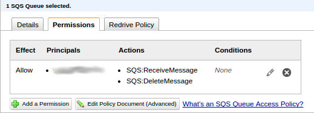
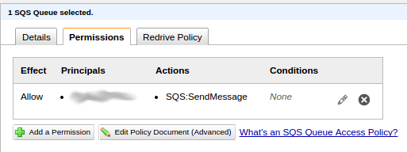

SQS is used by Cloud Transcode to receive commands and send out updates about jobs and activities. Clients who want to use Cloud Transcode will need to have dedicated communication channels for both input and output.

The owner of the stack MUST provision those SQS queues and entitle the clients correctly.

<b>Note:</b> If you run the clients with the same credentials as the SQS queues owner, then you don't need entitlements. The owner can by default access the queues.

### Setting up SQS channels

The Stack Admin need to configure two communication channels per client:

   - input: The client sends its commands through it and the stack listens to it
   - output: The stack sends updates and info about jobs and errors and the client listens to it.

The channels are created and owned by the AWS account and user running the CT Stack. So you must entitle your clients to send and receive messages to and from the Stack SQS channels.

First, in SQS, create two channels using the AWS web console:

   - input: Channel for input communication with your client "A". Let's name it "CT_ClientA_input".
   - output: Channel for output communication with your client "A". Let's name it "CT_ClientA_output".

### Permissions

Once the channels are created you must entitle your client to listen to the output channel and send message to the input channel. In order to entitle your client you need the client's AWS account number.

Once you have this information, you can create permissions for your client AWS accounts.

#### Output queue

 

 

Click "Add a permission" and add the same rights as shown above: ReceiveMessage and DeleteMessage for the account number provided by your client.

#### Input queue

 

 

Click "Add a permission" and add the same rights as shown above: Send Message for the account number provided by your client.

### Test connectivity

Test if you can message and poll each other. Use the AWS console on both accounts to send and receive messages.

